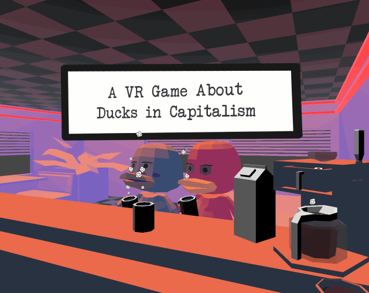

# A VR Game About Ducks in Capitalism

This is my submission for "I Want to Tell A Story, But I Can't Write 2020", a 14 day game jam with a theme of "Lost". Serve coffee to ducks, and help guide them through their troubles. 

    

You can download the game for free [here, on itch.io](https://request.itch.io/a-vr-game-about-ducks-in-capitalism). 

You're free to do whatever with this code, but if you do use it, it'd be real cool of you to link back to this page or the itch.io page (or both). Thanks!

### Some topics of interest in this repo

  * Simple toon shader (unlit shader graph, using a single light source when accounting for light normals)
  * Full coffee brewing system
  * Full dialog system, complete with support for multiple speakers, setting NPC animations when their lines starts, and a custom inspector to make writing dialog easier.
  
### Next Steps

If I had more time (always the case with these game jams), I'd focus on these things first:
  * Toon shader changes
    * Support for multiple light sources in the toon shader, for more varied lighting (See this vid by Snuti HQ: https://youtu.be/g8eBXCgWwrk)
    * An outline shader would be cool too - don't think this can easily be done via shader graph without writing shader code. Might have to be a pipeline asset.
  * Animation changes for NPC ducks, to avoid NPC head jerkiness
    * I was using a script to lerp the Animation Rig "lookat transform target" to some position, in order to have the NPC look at the player as they move around the scene. 
    * As part of the duck animator, this transform is also moved around. When an animation that moves this transform around starts, the lookat target does not ease into the animation's position. 
    * This causes an abrupt jerk in the NPC's head when the animation starts
  * Replace kinematic grab with velocity-based grab (so that grabbed objects collide with the environment)
  * Add mechanics to clean mugs, and stir coffee 
    * On trigger enter, calculate the distance of the sponge/spoon since last frame. If a certain total distance is surpassed, then the task (mug cleaned, or coffee stirred) would be complete.
  * More work on Dialog/dialogParser.py script to make copying dialog from text file into .unity scene file
    * Something about the output wasn't formatted properly for unity to accept it as valid - it didn't throw an exception, but it also didn't read the input properly. None of the lines pasted manually were accepted.
    * I suspect that this may have been due to line endings, but more work is required to confirm this. 
  
## Assets

Still trying to make my own assets for these game jams. The only borrowed assets for this game are the BGM.

  * Engine: Unity 2019.4.5f1
	  * URP
	  * TextMeshPro
  * BGM: Audio: [Chill LoFi Inspired](https://opengameart.org/content/chill-lofi-inspired), and [LoFi Hip Hop](https://opengameart.org/content/lofi-hip-hop) - both by omfgdude, licensed under [CC0 1.0 Universal (CC0 1.0) Public Domain Dedication](https://creativecommons.org/publicdomain/zero/1.0/)
